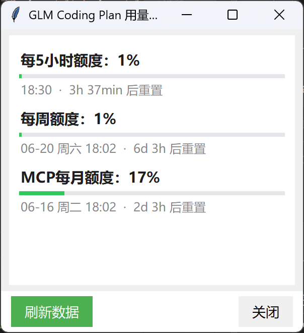
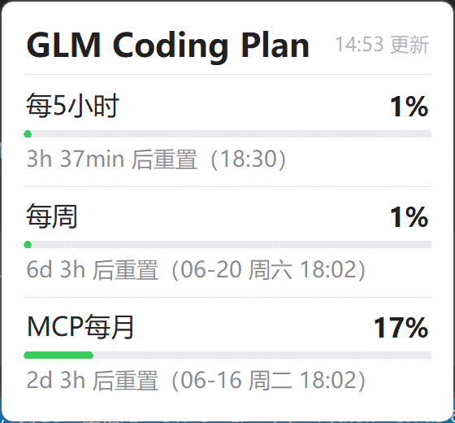

# GLM Usage Monitor

A lightweight Windows system tray tool that monitors [Zhipu AI](https://open.bigmodel.cn) GLM Coding Plan quota usage in real time — hover to check, at a glance.

 

[中文文档](README.md)

## Features

- **Hover to Check** — Hover over the tray icon to reveal a minimal card showing three quotas (5-hour / weekly / MCP monthly)
- **Color Indicator** — Tray icon displays 5-hour usage percentage with green / orange / red colors
- **Reset Countdown** — Each quota shows reset time so you can plan ahead
- **Auto Refresh** — Configurable interval from 1~30 minutes, silent background updates
- **Cache Fallback** — Automatically shows last cached data on network failure
- **Startup with Windows** — One-click toggle via Windows registry
- **Detail Window** — Double-click tray icon for detail panel with manual refresh
- **Single Instance** — Mutex lock prevents duplicate launches

## Installation

### Option 1: Download Pre-built (Recommended)

Download the latest `GLM用量监控.exe` from [Releases](../../releases) and run it directly.

### Option 2: Run from Source

```bash
# Clone the repo
git clone https://github.com/your-username/glm-usage-monitor.git
cd glm-usage-monitor

# Install dependencies
pip install -r requirements.txt

# Copy config template and fill in your API Key
cp config.example.json config.json
# Edit config.json, paste your Zhipu AI API Key

# Run
python main.py
```

## Quick Start

1. Right-click the tray icon → **Set API Key**
2. Get your API Key from [Zhipu AI Console](https://open.bigmodel.cn/usercenter/apikeys) and paste it
3. Hover over the tray icon to view usage

## Usage

| Action | Result |
|--------|--------|
| Hover over tray icon | Popup tooltip card showing all three quotas |
| Double-click tray icon | Open detail window |
| Right-click tray icon | Context menu (Refresh / Autostart / Interval / API Key / Exit) |

### Configuration File

`config.json` is generated on first run:

```json
{
  "api_key": "your-zhipu-api-key",
  "refresh_interval": 300,
  "autostart": true
}
```

| Field | Description | Default |
|-------|-------------|---------|
| `api_key` | Zhipu AI API Key | — |
| `refresh_interval` | Auto-refresh interval (seconds) | 300 (5 min) |
| `autostart` | Enable startup with Windows | false |

## Project Structure

```
glm-usage-monitor/
├── main.py              # Entry point
├── config.py            # Paths, constants, config/cache I/O, autostart
├── api.py               # API queries, data parsing, global state
├── widgets.py           # Tooltip card, detail window, API Key dialog
├── tray.py              # Tray icon, hover detection, auto-refresh, menu
├── config.example.json  # Config template
├── requirements.txt     # Python dependencies
├── GLM用量监控.spec     # PyInstaller build spec
├── 启动.bat             # Quick launch script for built exe
├── images/              # Screenshots
└── LICENSE              # MIT License
```

## Tech Stack

- **Python 3** + Tkinter (UI)
- [pystray](https://github.com/moses-palmer/pystray) (System Tray)
- [Pillow](https://python-pillow.org/) (Icon rendering)
- [requests](https://docs.python-requests.org/) (API requests)
- [PyInstaller](https://pyinstaller.org/) (Package as exe)

## Build

```bash
pyinstaller --noconfirm GLM用量监控.spec
```

Output: `dist/GLM用量监控.exe`.

## Contributing

Issues and Pull Requests are welcome!

1. Fork this repo
2. Create a feature branch: `git checkout -b feature/your-feature`
3. Commit changes: `git commit -m 'Add some feature'`
4. Push to branch: `git push origin feature/your-feature`
5. Submit a Pull Request

## License

[MIT License](LICENSE)

## Credits

- Data source: [Zhipu AI Platform](https://open.bigmodel.cn)
